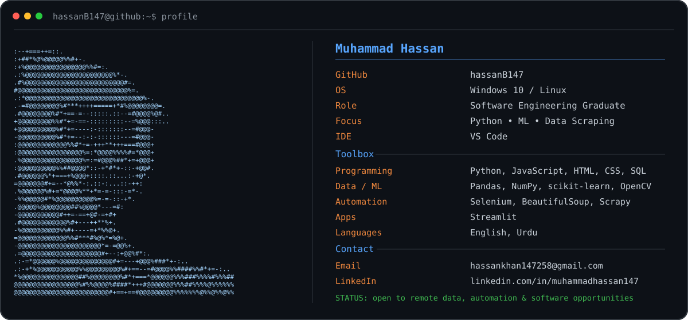

# Muhammad Hassan

  

## About Me

Software Engineering graduate focused on **Python, Machine Learning, Data Scraping, Automation, and Data-Driven Applications**.

I enjoy turning practical problems into useful tools—from web scraping and workflow automation to machine learning models and Streamlit applications.

- Based in Pakistan
- Interested in remote opportunities in **Data, Automation, Python, AI/ML, and Software Development**
- Currently improving my skills in **Generative AI, RAG, advanced data analytics, and production-ready Python applications**
- Open to collaborating on practical open-source projects

## Tech Stack

**Programming**  
Python · JavaScript · HTML · CSS · SQL

**Data & Machine Learning**  
Pandas · NumPy · scikit-learn · OpenCV

**Web Scraping & Automation**  
Selenium · BeautifulSoup · Scrapy

**Apps & Tools**  
Streamlit · Git · GitHub · VS Code

## Featured Work

### Machine Learning Internship Projects
- House Price Prediction
- Email Spam Detection
- Customer Churn Prediction
- Image Processing Projects

### Data Scraping & Automation
- Python-based web scraping
- Lead generation and structured data collection
- Browser automation with Selenium
- Data cleaning and export workflows

### AI & App Development
- Streamlit-based ML applications
- AI-assisted workflow tools
- Generative AI and RAG experimentation

## Selected Repositories

- [DEP Task No. 1](https://github.com/hassanB147/DEP-Task-No-1)
- [Email Spam Detection](https://github.com/hassanB147/DEP-TASK-2-Email_Spam_Detection)
- [Customer Churn Prediction](https://github.com/hassanB147/Digital-Empowerment-Pakistan-Machine-Learning-Task-3_Customer_Churn_Prediction)
- [Machine Learning Task 4](https://github.com/hassanB147/Digital-Empowerment-Pakistan-Machine-Learning-Task-4)
- [Image Processing Project](https://github.com/hassanB147/DEP_Hassan_Khan_Task5_ImageProcessing)
- [Wellix App](https://github.com/hassanB147/wellix-app)

## GitHub Activity

  

  

## Contact

- Email: **hassankhan147258@gmail.com**
- LinkedIn: [linkedin.com/in/muhammadhassan147](https://www.linkedin.com/in/muhammadhassan147/)
- GitHub: [github.com/hassanB147](https://github.com/hassanB147)

---

  <b>Building useful tools with Python, data, automation, and AI.</b>

